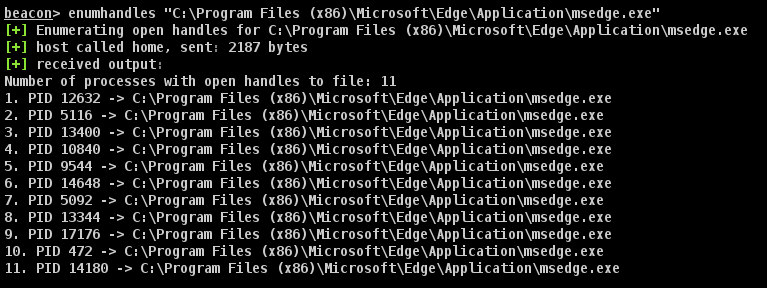

# enumhandles_BOF
This BOF can be used to identify processes that hold handles to a given file. This can be useful to identify which process is locking a file on disk.

# Usage

# Limitations
I have found that x86 beacons will crash sometimes when attempting to enumerate handles associated with an x64 image. For example, running `enumhandles c:\windows\sysnative\svchost.exe` may cause a crash.

# Credits
All credit for this technique belongs to [Grzegorz Tworek](https://x.com/0gtweet):

The specific tweet regarding this technique can be found [here](https://x.com/0gtweet/status/1829984410252325215).
